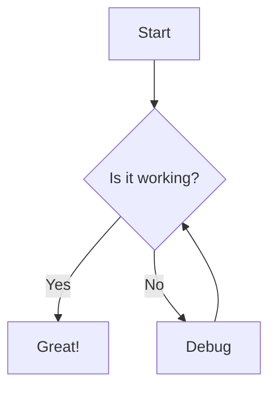

# TAFLEX Documentation

Welcome to the TAFLEX documentation source! This documentation is built using [MkDocs](https://www.mkdocs.org/) with the [Material theme](https://squidfunk.github.io/mkdocs-material/).

## 📚 Documentation Structure

```
docs/
├── index.md                          # Home page
├── getting-started/                  # Getting started guides
│   ├── quickstart.md
│   ├── installation.md
│   ├── configuration.md
│   └── first-test.md
├── architecture/                     # Architecture documentation
│   ├── overview.md
│   ├── strategy-pattern.md
│   ├── drivers.md
│   ├── locators.md
│   └── data-flow.md
├── guides/                           # User guides by role
│   ├── qa-engineers.md
│   ├── developers.md
│   ├── managers.md
│   └── devops.md
├── api/                              # API reference
│   └── core-interfaces.md
├── best-practices/                   # Best practices
│   ├── test-design.md
│   ├── locators.md
│   ├── error-handling.md
│   ├── cicd.md
│   └── performance.md
├── troubleshooting/                  # Troubleshooting
│   ├── common-issues.md
│   ├── debugging.md
│   └── faq.md
├── contributing/                     # Contributing guides
│   ├── guidelines.md
│   ├── code-style.md
│   └── pull-requests.md
├── assets/                           # Images, logos, etc.
├── stylesheets/                      # Custom CSS
├── mkdocs.yml                        # MkDocs configuration
└── requirements.txt                  # Python dependencies
```

## 🚀 Local Development

### Prerequisites

- Python 3.8+
- pip

### Setup

1. **Navigate to docs directory**:
   ```bash
   cd docs
   ```

2. **Create virtual environment** (optional but recommended):
   ```bash
   python -m venv venv
   source venv/bin/activate  # On Windows: venv\Scripts\activate
   ```

3. **Install dependencies**:
   ```bash
   pip install -r requirements.txt
   ```

4. **Start development server**:
   ```bash
   mkdocs serve
   ```

5. **Open browser**:
   Navigate to http://127.0.0.1:8000

The server will automatically reload when you make changes!

## 📝 Writing Documentation

### Markdown Extensions

We use several Markdown extensions for enhanced formatting:

#### Admonitions

```markdown
!!! note "Title"
    This is a note admonition.

!!! warning "Important"
    This is a warning.

!!! tip
    This is a helpful tip.

!!! success "Success"
    This indicates success.

!!! danger "Danger"
    This indicates danger.
```

#### Code Blocks

```markdown
```java title="Example.java" linenums="1"
public class Example {
    public static void main(String[] args) {
        System.out.println("Hello, TAFLEX!");
    }
}
```
```

#### Tabs

```markdown
=== "Option A"
    Content for option A

=== "Option B"
    Content for option B
```

#### Mermaid Diagrams

```markdown

```

#### Grid Layouts

```markdown
<div class="grid" markdown>

<div markdown>

### Column 1
Content here

</div>

<div markdown>

### Column 2
Content here

</div>

</div>
```

#### Icons

```markdown
:material-icon-name: Text

Example:
:material-rocket: Launch
:material-bug: Bug Report
:material-check: Complete
```

### Best Practices

1. **Use descriptive titles** - Clear, concise headings
2. **Include code examples** - Show, don't just tell
3. **Add diagrams** - Visual aids for complex concepts
4. **Cross-reference** - Link to related documentation
5. **Keep it updated** - Documentation should match code

### Style Guide

- Use sentence case for headings
- Use backticks for code: `variableName`
- Use bold for UI elements: **Click Submit**
- Use italics for emphasis: *important*
- Keep paragraphs short (3-5 lines max)
- Use bullet points for lists

## 🏗️ Building Documentation

### Local Build

```bash
mkdocs build
```

This creates a `site/` directory with static HTML files.

### Production Build

```bash
mkdocs build --strict
```

The `--strict` flag treats warnings as errors (recommended for CI).

## 🌐 Deployment

### GitHub Pages

```bash
mkdocs gh-deploy
```

This builds and deploys to the `gh-pages` branch.

### Docker

```bash
# Build Docker image
docker build -t taflex-docs .

# Run container
docker run -p 8000:8000 taflex-docs
```

### Other Platforms

The built `site/` directory can be deployed to:
- Netlify
- Vercel
- AWS S3
- Any static hosting service

## 🎨 Customization

### Colors

Edit `mkdocs.yml`:

```yaml
theme:
  palette:
    - media: "(prefers-color-scheme: light)"
      scheme: default
      primary: indigo
      accent: indigo
```

Available colors: `red`, `pink`, `purple`, `deep-purple`, `indigo`, `blue`, `light-blue`, `cyan`, `teal`, `green`, `light-green`, `lime`, `yellow`, `amber`, `orange`, `deep-orange`, `brown`, `grey`, `blue-grey`, `black`, `white`

### Custom CSS

Add to `docs/stylesheets/extra.css`:

```css
:root {
  --md-primary-fg-color: #1a237e;
  --md-accent-fg-color: #3949ab;
}

.custom-class {
  color: var(--md-primary-fg-color);
}
```

### Logo

Place your logo in `docs/assets/logo.png` and update `mkdocs.yml`:

```yaml
theme:
  logo: assets/logo.png
  favicon: assets/favicon.png
```

## 📊 Analytics

### Google Analytics

```yaml
extra:
  analytics:
    provider: google
    property: G-XXXXXXXXXX
```

### Custom Analytics

Add to `docs/javascripts/extra.js`:

```javascript
document.addEventListener('DOMContentLoaded', function() {
    // Your analytics code here
});
```

## 🔍 Search

Search is automatically enabled. To exclude pages from search:

```markdown
---
search:
  exclude: true
---

# Page Title
```

## 🏷️ Versioning

We use [mike](https://github.com/jimporter/mike) for versioning:

```bash
# Install mike
pip install mike

# Deploy version
mike deploy 1.0 latest

# Set default version
mike set-default latest
```

## 📝 Contributing to Documentation

1. **Fork the repository**
2. **Create a branch**: `git checkout -b docs/improvement`
3. **Make your changes**
4. **Test locally**: `mkdocs serve`
5. **Submit a PR**

### Documentation Checklist

Before submitting:
- [ ] All links work
- [ ] Images display correctly
- [ ] Code examples compile/run
- [ ] No spelling errors
- [ ] Consistent formatting
- [ ] Updated navigation (if added pages)

## 🔧 Troubleshooting

### Issue: Changes not reflecting

**Solution**:
```bash
# Clear MkDocs cache
rm -rf site/
mkdocs serve
```

### Issue: Mermaid diagrams not rendering

**Solution**: Ensure `pymdownx.superfences` with `custom_fences` is configured in `mkdocs.yml`.

### Issue: Icons not displaying

**Solution**: Check icon names at [Material Design Icons](https://materialdesignicons.com/)

## 📖 Resources

- [MkDocs Documentation](https://www.mkdocs.org/)
- [Material for MkDocs](https://squidfunk.github.io/mkdocs-material/)
- [PyMdown Extensions](https://facelessuser.github.io/pymdown-extensions/)
- [Mermaid Documentation](https://mermaid-js.github.io/mermaid/)

## 📞 Support

For documentation-specific issues:
- :fontawesome-brands-github: Open an issue
- :fontawesome-brands-slack: #taflex-docs channel
- :fontawesome-solid-envelope: docs@taflex.io

---

**Happy Documenting! 🚀**