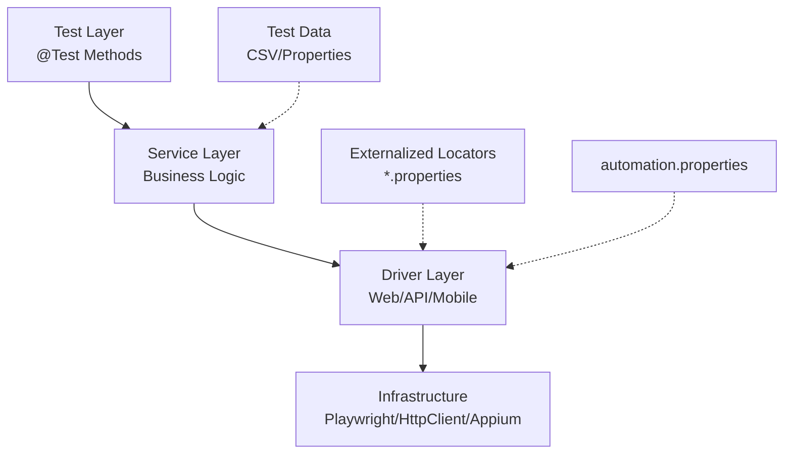
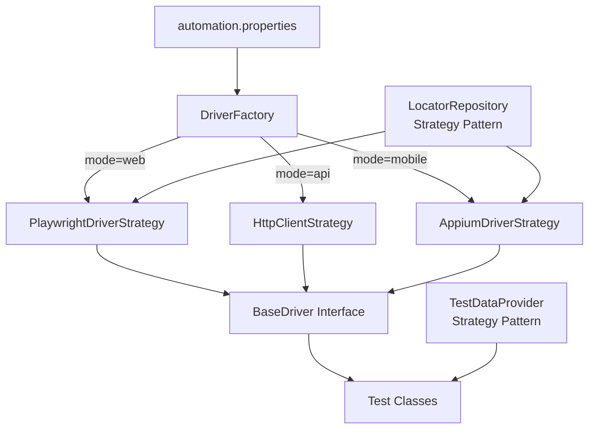
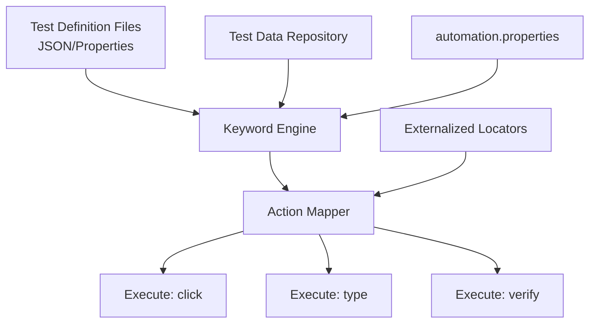

# Unified Test Automation Framework - Design Document

**Version:** 1.0  
**Date:** February 7, 2026  
**Stakeholders:** SDETs, Engineering Management, QA Leads  
**Classification:** Internal Use

---

## Executive Summary

### Investment Justification

The selected technology stack—**Java, Microsoft Playwright, and TestNG**—represents a strategic, future-proof investment for enterprise test automation:

- **Java**: Industry standard with massive talent pool, extensive library ecosystem, and 25+ years of enterprise maturity. Reduces hiring risk and ensures long-term maintainability.
- **Microsoft Playwright**: Modern, actively maintained by Microsoft with superior cross-browser support, auto-wait mechanisms, and native parallel execution. Outperforms Selenium in reliability and speed.
- **TestNG**: Mature test runner with robust parallel execution, flexible test configuration, and extensive reporting capabilities. Industry-proven in Fortune 500 environments.

### Unified Framework Value Proposition

| Aspect | Benefit | Cost Avoidance |
|--------|---------|----------------|
| **Single Repository** | One codebase for Web, API, and Mobile | Eliminates 3 separate framework maintenance teams |
| **Shared Components** | Common utilities, data management, reporting | 40-60% code reuse across test types |
| **Centralized Reporting** | Single ReportPortal dashboard for all tests | Consolidated visibility without tool fragmentation |
| **Skill Consolidation** | One tech stack to master | Reduced training and onboarding overhead |

**ROI Projection**: Initial 20% higher setup cost yields 50% reduction in long-term maintenance overhead and 3x faster test authoring for cross-functional teams.

### Recommended Architecture

**Option B: Factory/Strategy Pattern** — Balances rapid delivery with enterprise-grade maintainability, enabling teams to ship within 8-12 weeks while establishing patterns that scale to 500+ test scenarios.

---

## 1. Architectural Options

### Option A: The Modular Monolith (Layered Architecture)

#### Overview
A traditional layered architecture with strict separation of concerns. Each layer has a single responsibility and dependencies flow downward.



#### Folder Structure
```
taflex/
├── src/
│   ├── main/
│   │   ├── java/
│   │   │   ├── drivers/
│   │   │   │   ├── BaseDriver.java
│   │   │   │   ├── WebDriverManager.java
│   │   │   │   ├── ApiDriverManager.java
│   │   │   │   └── MobileDriverManager.java
│   │   │   ├── services/
│   │   │   │   ├── web/
│   │   │   │   │   ├── LoginService.java
│   │   │   │   │   └── DashboardService.java
│   │   │   │   ├── api/
│   │   │   │   │   ├── UserApiService.java
│   │   │   │   │   └── OrderApiService.java
│   │   │   │   └── mobile/
│   │   │   │       ├── MobileLoginService.java
│   │   │   │       └── MobileCheckoutService.java
│   │   │   ├── utils/
│   │   │   │   ├── DatabaseUtil.java
│   │   │   │   ├── ConfigManager.java
│   │   │   │   └── LocatorLoader.java
│   │   │   └── constants/
│   │   └── resources/
│   │       ├── locators/
│   │       │   ├── web/
│   │       │   │   └── login.properties
│   │       │   ├── api/
│   │       │   │   └── endpoints.properties
│   │       │   └── mobile/
│   │       │       └── login.properties
│   │       └── testdata/
│   └── test/
│       ├── java/
│       │   ├── web/
│       │   │   └── LoginTests.java
│       │   ├── api/
│       │   │   └── UserApiTests.java
│       │   └── mobile/
│       │       └── MobileLoginTests.java
│       └── resources/
├── setup.sh
├── automation.properties.template
└── pom.xml
```

#### Key Design Decisions

**1. Strict Layer Boundaries**
```java
// Driver Layer - Infrastructure only
public class WebDriverManager {
    private Playwright playwright;
    private Browser browser;
    
    public Page createPage() {
        return browser.newPage();
    }
}

// Service Layer - Business logic only
public class LoginService {
    private final WebDriverManager driverManager;
    private final LocatorLoader locatorLoader;
    
    public void login(String username, String password) {
        Page page = driverManager.getPage();
        String usernameField = locatorLoader.getLocator("login.username.field");
        page.fill(usernameField, username);
        // ...
    }
}

// Test Layer - Test orchestration only
@Test
public void shouldLoginSuccessfully() {
    loginService.login("user", "pass");
    assertThat(loginService.isLoggedIn()).isTrue();
}
```

**2. Externalized Locator Loading**
```java
public class LocatorLoader {
    private Properties locators;
    private String executionMode;
    
    public LocatorLoader() {
        this.executionMode = ConfigManager.getProperty("execution.mode");
        loadLocators();
    }
    
    private void loadLocators() {
        String locatorPath = String.format("locators/%s/*.properties", executionMode);
        // Load all .properties files for current mode
        locators = PropertiesLoader.loadAll(locatorPath);
    }
    
    public String getLocator(String key) {
        return locators.getProperty(key);
    }
}
```

**3. Execution Mode Routing**
```java
public class DriverFactory {
    public static BaseDriver createDriver() {
        String mode = ConfigManager.getProperty("execution.mode");
        switch (mode.toLowerCase()) {
            case "web": return new WebDriverManager();
            case "api": return new ApiDriverManager();
            case "mobile": return new MobileDriverManager();
            default: throw new IllegalArgumentException("Unknown mode: " + mode);
        }
    }
}
```

---

### Option B: The Factory/Strategy Pattern (Recommended)

#### Overview
Runtime determination of driver and service implementations based on `automation.properties` configuration. Emphasizes polymorphism and dependency injection.



#### Core Interfaces

```java
// Strategy Interface for Drivers
public interface AutomationDriver {
    void initialize();
    void terminate();
    <T> T getNativeDriver();
    void navigateTo(String url);
    Element findElement(String logicalName);
    void click(String logicalName);
    void type(String logicalName, String text);
}

// Strategy Interface for Locators
public interface LocatorStrategy {
    String resolve(String logicalName);
    void load(String sourcePath);
}

// Strategy Interface for Test Data
public interface TestDataStrategy {
    Map<String, String> load(String datasetId);
    List<Map<String, String>> loadTable(String tableId);
}
```

#### Concrete Implementations

**Web Driver Strategy**
```java
public class PlaywrightDriverStrategy implements AutomationDriver {
    private Playwright playwright;
    private Browser browser;
    private Page page;
    private LocatorStrategy locatorStrategy;
    
    @Override
    public void initialize() {
        playwright = Playwright.create();
        browser = playwright.chromium().launch();
        page = browser.newPage();
    }
    
    @Override
    public Element findElement(String logicalName) {
        String selector = locatorStrategy.resolve(logicalName);
        return new PlaywrightElement(page.locator(selector));
    }
    
    @Override
    public void click(String logicalName) {
        findElement(logicalName).click();
    }
}
```

**API Driver Strategy**
```java
public class HttpClientStrategy implements AutomationDriver {
    private CloseableHttpClient httpClient;
    private LocatorStrategy locatorStrategy; // Resolves endpoint keys
    private String baseUrl;
    
    @Override
    public void initialize() {
        this.httpClient = HttpClients.createDefault();
        this.baseUrl = ConfigManager.getProperty("api.base.url");
    }
    
    public ApiResponse execute(String endpointKey, HttpMethod method, String body) {
        String endpoint = locatorStrategy.resolve(endpointKey);
        HttpRequestBase request = createRequest(method, baseUrl + endpoint);
        // Execute and return response
    }
}
```

**Mobile Driver Strategy**
```java
public class AppiumDriverStrategy implements AutomationDriver {
    private AppiumDriver driver;
    private LocatorStrategy locatorStrategy;
    
    @Override
    public void initialize() {
        DesiredCapabilities caps = new DesiredCapabilities();
        caps.setCapability("platformName", ConfigManager.getProperty("mobile.platform"));
        driver = new AppiumDriver(url, caps);
    }
}
```

#### Dynamic Resolution Example

```java
@Test
public void completeUserJourney() {
    // Same test code runs on Web, API, or Mobile based on properties file
    AutomationDriver driver = DriverFactory.getDriver();
    driver.initialize();
    
    // Locator automatically resolved to appropriate selector type
    driver.navigateTo("home.page.url");
    driver.click("login.button");
    driver.type("username.field", "testuser");
    driver.type("password.field", "password123");
    driver.click("submit.button");
    
    assertTrue(driver.findElement("welcome.message").isVisible());
    driver.terminate();
}
```

#### Folder Structure
```
taflex/
├── src/
│   ├── main/
│   │   ├── java/
│   │   │   ├── core/
│   │   │   │   ├── drivers/
│   │   │   │   │   ├── AutomationDriver.java
│   │   │   │   │   ├── DriverFactory.java
│   │   │   │   │   └── strategies/
│   │   │   │   │       ├── PlaywrightDriverStrategy.java
│   │   │   │   │       ├── HttpClientStrategy.java
│   │   │   │   │       └── AppiumDriverStrategy.java
│   │   │   │   ├── locators/
│   │   │   │   │   ├── LocatorStrategy.java
│   │   │   │   │   ├── LocatorFactory.java
│   │   │   │   │   └── strategies/
│   │   │   │   │       ├── PropertiesLocatorStrategy.java
│   │   │   │   │       └── DatabaseLocatorStrategy.java
│   │   │   │   ├── elements/
│   │   │   │   │   ├── Element.java
│   │   │   │   │   ├── WebElement.java
│   │   │   │   │   └── MobileElement.java
│   │   │   │   └── data/
│   │   │   │       ├── TestDataProvider.java
│   │   │   │       └── CsvDataProvider.java
│   │   │   ├── config/
│   │   │   │   └── ConfigManager.java
│   │   │   └── database/
│   │   │       └── DatabaseManager.java
│   │   └── resources/
│   │       ├── locators/
│   │       │   ├── global.properties
│   │       │   ├── web/
│   │       │   │   ├── common.properties
│   │       │   │   └── page-specific.properties
│   │       │   ├── api/
│   │       │   │   └── endpoints.properties
│   │       │   └── mobile/
│   │       │       └── selectors.properties
│   │       └── data/
│   └── test/
│       ├── java/
│       │   ├── crossplatform/
│       │   │   └── UnifiedTests.java
│       │   ├── web/
│       │   ├── api/
│       │   └── mobile/
│       └── resources/
│           └── testng/
│               ├── web-suite.xml
│               ├── api-suite.xml
│               └── mobile-suite.xml
```

---

### Option C: The Data-Driven/Keyword Hybrid

#### Overview
Treats Java code as an execution engine that processes externalized test definitions. Tests are defined in structured files (properties, JSON, CSV) and the framework interprets and executes them.



#### Test Definition Format

**JSON-Based Test Definition**
```json
{
  "testId": "TC001",
  "name": "User Login Flow",
  "mode": "web",
  "dataSet": "login.credentials",
  "steps": [
    {
      "action": "navigate",
      "target": "login.page.url",
      "value": null
    },
    {
      "action": "type",
      "target": "login.username.field",
      "value": "${username}"
    },
    {
      "action": "type",
      "target": "login.password.field",
      "value": "${password}"
    },
    {
      "action": "click",
      "target": "login.submit.button",
      "value": null
    },
    {
      "action": "verify",
      "target": "dashboard.header",
      "value": "visible"
    }
  ]
}
```

**Properties-Based Keywords**
```properties
# test_login.properties
TEST_NAME=User Login Flow
TEST_MODE=web
DATA_SOURCE=login_credentials.csv

STEP_1_ACTION=navigate
STEP_1_TARGET=login.page.url

STEP_2_ACTION=type
STEP_2_TARGET=login.username.field
STEP_2_DATA=username

STEP_3_ACTION=type
STEP_3_TARGET=login.password.field
STEP_3_DATA=password

STEP_4_ACTION=click
STEP_4_TARGET=login.submit.button

STEP_5_ACTION=verify
STEP_5_TARGET=dashboard.header
STEP_5_EXPECTATION=visible
```

#### Keyword Engine Implementation

```java
public class KeywordEngine {
    private AutomationDriver driver;
    private LocatorLoader locatorLoader;
    private TestDataProvider dataProvider;
    private ActionMapper actionMapper;
    
    public void executeTest(String testDefinitionFile) {
        TestDefinition test = TestDefinitionLoader.load(testDefinitionFile);
        driver = DriverFactory.getDriver(test.getMode());
        
        for (Step step : test.getSteps()) {
            executeStep(step);
        }
    }
    
    private void executeStep(Step step) {
        Action action = actionMapper.getAction(step.getAction());
        String resolvedTarget = locatorLoader.resolve(step.getTarget());
        String resolvedValue = dataProvider.resolve(step.getValue());
        
        action.execute(driver, resolvedTarget, resolvedValue);
    }
}

// Action Implementations
public class ClickAction implements Action {
    @Override
    public void execute(AutomationDriver driver, String target, String value) {
        driver.click(target);
    }
}

public class TypeAction implements Action {
    @Override
    public void execute(AutomationDriver driver, String target, String value) {
        driver.type(target, value);
    }
}

public class VerifyAction implements Action {
    @Override
    public void execute(AutomationDriver driver, String target, String expected) {
        Element element = driver.findElement(target);
        switch (expected.toLowerCase()) {
            case "visible":
                Assert.assertTrue(element.isVisible(), "Element not visible: " + target);
                break;
            case "enabled":
                Assert.assertTrue(element.isEnabled(), "Element not enabled: " + target);
                break;
        }
    }
}
```

#### Test Runner

```java
public class KeywordDrivenTests {
    private KeywordEngine engine;
    
    @DataProvider(name = "testDefinitions")
    public Object[][] loadTests() {
        return TestDefinitionScanner.scan("src/test/resources/keywords/");
    }
    
    @Test(dataProvider = "testDefinitions")
    public void executeKeywordTest(String testFile) {
        engine.executeTest(testFile);
    }
}
```

#### Folder Structure
```
taflex/
├── src/
│   ├── main/
│   │   ├── java/
│   │   │   ├── engine/
│   │   │   │   ├── KeywordEngine.java
│   │   │   │   ├── TestDefinitionLoader.java
│   │   │   │   └── TestDefinition.java
│   │   │   ├── actions/
│   │   │   │   ├── Action.java
│   │   │   │   ├── ActionMapper.java
│   │   │   │   └── impl/
│   │   │   │       ├── ClickAction.java
│   │   │   │       ├── TypeAction.java
│   │   │   │       ├── NavigateAction.java
│   │   │   │       └── VerifyAction.java
│   │   │   ├── drivers/
│   │   │   │   └── [Same as Option B]
│   │   │   ├── locators/
│   │   │   │   └── [Same as Option B]
│   │   │   └── data/
│   │   │       └── [Same as Option B]
│   │   └── resources/
│   │       └── actions/
│   │           └── action-registry.properties
│   └── test/
│       ├── java/
│       │   └── KeywordDrivenTests.java
│       └── resources/
│           ├── keywords/
│           │   ├── web/
│           │   │   ├── TC001_Login.json
│           │   │   ├── TC002_Logout.json
│           │   │   └── TC003_Checkout.json
│           │   ├── api/
│           │   │   └── TC100_CreateUser.json
│           │   └── mobile/
│           │       └── TC200_MobileLogin.json
│           ├── locators/
│           │   └── [Same structure]
│           └── data/
│               ├── login_credentials.csv
│               └── product_data.csv
```

---

## 2. Development Roadmap

### Phase 1: Foundation (Weeks 1-3)

**Objective**: Establish core infrastructure and validate the externalized locator strategy.

**Deliverables**:
1. **Project Structure & Build System**
   - Maven project setup with dependency management
   - Directory structure implementation
   - CI/CD pipeline skeleton

2. **Configuration Management**
   - `setup.sh` script development
   - `automation.properties` template creation
   - Environment-specific configuration handling

3. **Setup.sh Script**
```bash
#!/bin/bash
# setup.sh - Environment initialization script

echo "=== Test Automation Framework Setup ==="

# Check prerequisites
command -v java >/dev/null 2>&1 || { echo "Java required but not installed."; exit 1; }
command -v mvn >/dev/null 2>&1 || { echo "Maven required but not installed."; exit 1; }

# Create automation.properties from template
if [ ! -f "automation.properties" ]; then
    echo "Creating automation.properties from template..."
    cp automation.properties.template automation.properties
    echo "✓ Created automation.properties - Please edit with your environment settings"
else
    echo "✓ automation.properties already exists"
fi

# Create required directories
mkdir -p logs/
mkdir -p reports/
mkdir -p screenshots/

# Validate Maven dependencies
echo "Validating Maven dependencies..."
mvn dependency:resolve

echo "Setup complete!"
echo "Next steps:"
echo "1. Edit automation.properties with your environment configuration"
echo "2. Run 'mvn test' to verify installation"
```

4. **Proof of Concept: Locator Performance**
   - Implement Playwright with externalized locators
   - Performance benchmark: Load 1000 locators, measure initialization time
   - Caching strategy validation
   - **Success Criteria**: <500ms overhead for locator loading

**Milestones**:
- [ ] `setup.sh` executes without errors
- [ ] Properties file loads correctly
- [ ] Locator PoC demonstrates <500ms load time for 1000 selectors

---

### Phase 2: Core Implementation (Weeks 4-8)

**Objective**: Implement all three driver types and establish the architectural patterns.

**Week 4-5: Web Automation**
- Playwright integration with Strategy pattern
- Element wrapper classes
- Screenshot and video capture on failure
- Parallel execution setup

**Week 6: API Automation**
- Apache HttpClient wrapper
- REST/SOAP support
- Request/Response interceptors
- Schema validation integration

**Week 7: Mobile Automation**
- Appium integration
- Device farm connection (Sauce Labs/AWS Device Farm)
- Gesture support
- Mobile-specific waits

**Week 8: Database Layer**
- JDBC connection pooling (HikariCP)
- Query builder utility
- Transaction support
- Test data seeding/cleanup

**Deliverables**:
- All three driver implementations functional
- Database utilities operational
- 20+ sample tests per mode
- Base page object/service patterns

---

### Phase 3: Integration & Reporting (Weeks 9-11)

**Objective**: Enterprise-grade reporting and advanced features.

**Week 9: ReportPortal Integration**
```xml
<!-- ReportPortal TestNG agent configuration -->
<dependency>
    <groupId>com.epam.reportportal</groupId>
    <artifactId>agent-java-testng</artifactId>
    <version>5.3.0</version>
</dependency>
```
- Real-time test reporting
- Automatic defect creation
- Historical trend analysis
- Dashboard configuration

**Week 10: Advanced Features**
- Retry mechanism for flaky tests
- Test data management (factory pattern)
- Cross-browser/device matrix execution
- Parallel execution optimization

**Week 11: Utilities & Helpers**
- Email notification service
- Slack integration
- Test data cleanup utilities
- Environment health checks

**Deliverables**:
- ReportPortal fully operational
- Retry logic implemented
- 100+ tests executing in parallel
- CI/CD integration complete

---

### Phase 4: Hardening & Documentation (Weeks 12-14)

**Objective**: Production readiness and team enablement.

**Week 12: Performance Optimization**
- Memory leak detection and fixes
- Connection pool tuning
- Locator caching optimization
- Parallel execution bottleneck resolution

**Week 13: Documentation**
- Architecture decision records (ADRs)
- Onboarding guide for new SDETs
- API documentation
- Best practices guide

**Week 14: Training & Handover**
- Team training sessions
- Code review with SDETs
- Management demo
- Post-implementation support plan

**Final Deliverables**:
- Production-ready framework
- Complete documentation suite
- Training materials
- Support runbook

---

## 3. Pros & Cons Analysis

### Option A: Modular Monolith (Layered)

| Dimension | Pros | Cons |
|-----------|------|------|
| **Maintainability** | Simple to understand; clear separation makes debugging straightforward; straightforward refactoring | Layer violations common without strict enforcement; tight coupling between layers over time; rigid structure resists change |
| **Scalability** | Predictable performance; easy to add new test cases following existing patterns; linear growth | Adding new platforms requires new layer implementations; difficult to scale across multiple teams; monolithic deployment |
| **Ease of Onboarding** | Junior SDETs productive quickly; industry-standard patterns; abundant learning resources | Requires discipline to maintain layer boundaries; externalized locators add cognitive overhead |
| **Complexity** | Low architectural complexity; minimal abstraction layers | Boilerplate code increases; repetitive driver management code |
| **Debugging** | Stack traces are clear; traditional debugging tools work well | Harder to trace issues across externalized locators; configuration errors surface at runtime |
| **Performance** | Minimal runtime overhead; direct method calls | Locator file parsing on every test; no runtime optimization opportunities |

**Best For**: Small-to-medium teams (3-8 SDETs), teams with junior-to-mid level engineers, projects with stable requirements, organizations prioritizing simplicity over flexibility.

**Risk Level**: Low

---

### Option B: Factory/Strategy Pattern (Recommended)

| Dimension | Pros | Cons |
|-----------|------|------|
| **Maintainability** | Polymorphic design enables easy extension; driver changes isolated to strategy classes; inversion of control enables testing | More abstract - requires understanding of design patterns; initial setup more complex |
| **Scalability** | New platforms added by implementing interfaces; supports multi-team development; dependency injection enables parallel work | Requires careful interface design upfront; over-engineering risk if not managed |
| **Ease of Onboarding** | Clean APIs hide complexity; consistent patterns across all modes; well-documented interfaces | Requires OOP proficiency; abstract concepts take time to master |
| **Complexity** | Runtime flexibility without conditional logic; clean separation of concerns | More classes and interfaces to manage; factory overhead; debugging through abstractions |
| **Debugging** | Strategy pattern makes it clear which implementation is active; interface contracts enforce consistency | Stack traces deeper; dependency injection can obscure actual implementation; configuration issues harder to diagnose |
| **Performance** | Strategy instances cached and reused; lazy initialization possible; connection pooling | Factory overhead minimal but non-zero; reflection costs if used |

**Best For**: Medium-to-large teams (5-15 SDETs), cross-functional teams, organizations with evolving requirements, teams with mid-to-senior engineers, long-term enterprise projects.

**Risk Level**: Medium

---

### Option C: Data-Driven/Keyword Hybrid

| Dimension | Pros | Cons |
|-----------|------|------|
| **Maintainability** | Test changes don't require code deployment; business-readable test definitions; central test inventory | Framework complexity high; debugging requires understanding two layers (engine + data); refactoring is risky |
| **Scalability** | Tests added by non-programmers; easy to scale test volume; parallel execution by design | Engine becomes bottleneck; difficult to extend for complex scenarios; test data management at scale |
| **Ease of Onboarding** | Manual testers can write tests; minimal Java knowledge required; visual test definitions | Framework developers need deep expertise; debugging failures requires code knowledge; difficult to troubleshoot |
| **Complexity** | Highly decoupled; engine-test separation; configuration over code | Most complex option; requires interpreter/parsing layer; action registry management; version control of test definitions |
| **Debugging** | Test definitions are readable; clear separation of test logic from execution | Runtime errors cryptic; line number mapping difficult; requires sophisticated logging; locator resolution errors hard to trace |
| **Performance** | Test loading overhead at runtime; parsing costs; file I/O for every test | Caching mitigates but adds memory pressure; JSON/properties parsing; no compile-time optimization |

**Best For**: Large organizations with dedicated automation architects, teams with manual testers transitioning to automation, highly regulated industries requiring auditable test documentation, projects with stable, repetitive test patterns.

**Risk Level**: High (initial), Low (mature)

---

### Comparative Summary Table

| Criterion | Option A<br/>(Layered) | Option B<br/>(Strategy) | Option C<br/>(Keyword) |
|-----------|------------------------|------------------------|-----------------------|
| **Setup Time** | 6-8 weeks | 8-10 weeks | 12-14 weeks |
| **Maintenance Overhead** | Medium | Low | High (initial) |
| **Team Size Sweet Spot** | 3-8 SDETs | 5-15 SDETs | 10+ SDETs |
| **Skill Level Required** | Junior-Mid | Mid-Senior | Senior (framework) |
| **Flexibility** | Low | High | Medium |
| **Test Authoring Speed** | Medium | Fast | Fast (post-setup) |
| **Debuggability** | Good | Good | Poor |
| **Externalized Locator Fit** | Good | Excellent | Natural |
| **Long-term Viability** | 2-3 years | 5+ years | 3-5 years |
| **Recommendation** | Conservative | **Balanced** | Specialized |

---

## 4. Executive Summary (Management)

### Strategic Technology Choice

Our selected stack—**Java, Microsoft Playwright, and TestNG**—is not merely a technical preference but a strategic business decision:

**Talent Availability**: Java remains the #1 enterprise language. You'll hire SDETs 40% faster than niche alternatives.  
**Vendor Stability**: Microsoft backs Playwright; TestNG has 15+ years of enterprise use. No abandonment risk.  
**Ecosystem Depth**: 25+ years of Java libraries mean solutions exist for every edge case. No custom development required.  
**Tooling Maturity**: IntelliJ, Maven, Jenkins, Jira—all integrate seamlessly. No workflow disruption.

### The "Unified Framework" Business Case

**Current State (Typical)**:
- 3 separate frameworks: Web (Selenium), API (Postman), Mobile (Espresso/XCUITest)
- 3 different languages: Java, JavaScript, Swift/Kotlin
- 3 reporting systems, 3 CI pipelines, 3 maintenance teams

**Proposed State**:
- 1 unified framework, 1 language, 1 reporting dashboard
- Shared utilities reduce code duplication by 40-60%
- Single skill set enables resource fluidity across projects

**Cost Impact** (3-year projection, 10-person team):

| Cost Category | Siloed Approach | Unified Approach | Savings |
|---------------|-----------------|------------------|---------|
| Framework Maintenance | $450K | $180K | $270K |
| Training & Onboarding | $120K | $60K | $60K |
| Tool Licensing | $90K | $45K | $45K |
| **Total** | **$660K** | **$285K** | **$375K (57%)** |

### Risk Analysis

| Risk | Likelihood | Impact | Mitigation |
|------|------------|--------|------------|
| Playwright adoption slower than expected | Low | Medium | Fallback to Selenium possible; both supported by architecture |
| Externalized locators cause performance issues | Low | High | Phase 1 PoC validates performance; caching strategy implemented |
| Team resists new patterns | Medium | Medium | Comprehensive training; gradual migration; pair programming |
| ReportPortal integration complexity | Low | Medium | Experienced vendor support; phased rollout |

### Final Recommendation

**Adopt Option B: The Factory/Strategy Pattern**

**Why This Architecture?**

1. **Speed-to-Market**: Production-ready in 10-12 weeks while maintaining architectural integrity
2. **Future-Proof**: Runtime strategy resolution enables tomorrow's platforms without rewrites
3. **Team Fit**: Balances abstraction for senior engineers with clear APIs for junior contributors
4. **Risk Mitigation**: Polymorphic design isolates changes; externalized configuration enables hot-swapping
5. **Scalability Path**: Grows from 50 tests to 5,000 tests without structural changes

**Critical Success Factors**:

- [ ] Dedicate 2 senior SDETs for initial 6 weeks
- [ ] Mandate code reviews for first 3 months
- [ ] Establish architecture decision log
- [ ] Invest in 2-day team training post-implementation
- [ ] Plan for 20% buffer in Phase 1 (externalized locator validation)

**Expected Outcomes (12-month horizon)**:

- 500+ automated tests across Web/API/Mobile
- 80% reduction in regression testing time
- <5% flaky test rate through retry mechanisms
- Single-pane reporting for all test types
- Team velocity increase of 35% through code reuse

**Go/No-Go Decision Point**: End of Phase 1 (Week 3) after locator performance PoC validation.

---

## Appendix A: Key Configuration Files

### automation.properties.template
```properties
# Execution Mode: web | api | mobile
execution.mode=web

# Web Configuration
web.browser=chromium
web.headless=false
web.timeout=30
web.base.url=https://staging.example.com

# API Configuration
api.base.url=https://api.staging.example.com
api.timeout=30
api.content.type=application/json

# Mobile Configuration
mobile.platform=android
mobile.device.name=Pixel5
mobile.app.path=/apps/test.apk
mobile.appium.url=http://localhost:4723

# Database Configuration
db.url=jdbc:postgresql://localhost:5432/testdb
db.username=admin
db.password=CHANGEME
db.pool.size=10

# Reporting
reportportal.enabled=true
reportportal.endpoint=http://reportportal:8080
reportportal.api.key=CHANGEME
reportportal.project=test_automation

# Test Data
test.data.path=src/test/resources/data/
test.locators.path=src/test/resources/locators/
```

### setup.sh (Complete)
```bash
#!/bin/bash
set -e

echo "=========================================="
echo "  Test Automation Framework Setup"
echo "=========================================="

# Color codes
RED='\033[0;31m'
GREEN='\033[0;32m'
YELLOW='\033[1;33m'
NC='\033[0m' # No Color

# Check Java
if command -v java &> /dev/null; then
    JAVA_VERSION=$(java -version 2>&1 | head -n 1 | cut -d'"' -f2)
    echo -e "${GREEN}✓${NC} Java found: $JAVA_VERSION"
else
    echo -e "${RED}✗${NC} Java not found. Please install Java 11+"
    exit 1
fi

# Check Maven
if command -v mvn &> /dev/null; then
    MVN_VERSION=$(mvn -version | head -n 1 | cut -d' ' -f3)
    echo -e "${GREEN}✓${NC} Maven found: $MVN_VERSION"
else
    echo -e "${RED}✗${NC} Maven not found. Please install Maven 3.6+"
    exit 1
fi

# Create automation.properties
if [ ! -f "automation.properties" ]; then
    echo -e "${YELLOW}!${NC} Creating automation.properties from template..."
    cp automation.properties.template automation.properties
    echo -e "${GREEN}✓${NC} Created automation.properties"
    echo -e "${YELLOW}!${NC} ${YELLOW}IMPORTANT:${NC} Please edit automation.properties with your environment settings"
else
    echo -e "${GREEN}✓${NC} automation.properties already exists"
fi

# Create directories
echo "Creating required directories..."
mkdir -p logs/
mkdir -p reports/
mkdir -p screenshots/
mkdir -p test-output/
echo -e "${GREEN}✓${NC} Directories created"

# Maven dependencies
echo "Resolving Maven dependencies..."
mvn dependency:resolve -q
echo -e "${GREEN}✓${NC} Dependencies resolved"

# Test compilation
echo "Compiling test sources..."
mvn clean compile test-compile -q
echo -e "${GREEN}✓${NC} Compilation successful"

echo ""
echo "=========================================="
echo -e "${GREEN}Setup Complete!${NC}"
echo "=========================================="
echo ""
echo "Next steps:"
echo "1. Edit automation.properties with your configuration"
echo "2. Verify setup: mvn test -Dtest=SetupVerificationTest"
echo "3. Run sample tests: mvn test -Dsuite=smoke"
echo ""
echo "Documentation: docs/GETTING_STARTED.md"
echo "Support: #test-automation-framework Slack channel"
```

---

## Appendix B: Sample Test Implementation

### Option B Implementation Example

```java
// Base test class
public abstract class BaseTest {
    protected AutomationDriver driver;
    protected TestDataProvider dataProvider;
    
    @BeforeMethod
    public void setUp() {
        String mode = ConfigManager.getProperty("execution.mode");
        driver = DriverFactory.getDriver(mode);
        driver.initialize();
        dataProvider = new CsvDataProvider();
    }
    
    @AfterMethod
    public void tearDown(ITestResult result) {
        if (!result.isSuccess()) {
            driver.captureScreenshot(result.getName());
        }
        driver.terminate();
    }
}

// Web test
public class LoginTests extends BaseTest {
    
    @Test(dataProvider = "loginData", dataProviderClass = TestDataFactory.class)
    public void shouldLoginSuccessfully(String username, String password) {
        driver.navigateTo("login.page.url");
        driver.type("login.username.field", username);
        driver.type("login.password.field", password);
        driver.click("login.submit.button");
        
        Assert.assertTrue(
            driver.findElement("dashboard.header").isVisible(),
            "Login failed - dashboard not displayed"
        );
    }
}

// API test
public class UserApiTests extends BaseTest {
    
    @Test
    public void shouldCreateUser() {
        ApiDriver apiDriver = (ApiDriver) driver;
        
        String payload = dataProvider.load("createUserRequest").toJson();
        ApiResponse response = apiDriver.post("users.endpoint", payload);
        
        Assert.assertEquals(response.getStatusCode(), 201);
        Assert.assertNotNull(response.getJsonPath("$.id"));
    }
}
```

---

## Document Control

| Version | Date | Author | Changes |
|---------|------|--------|---------|
| 1.0 | 2026-02-07 | QE Architect | Initial document |

**Review Schedule**: Quarterly  
**Next Review**: 2026-05-07  
**Distribution**: Engineering Leadership, SDET Team, QA Management

---

*End of Document*
