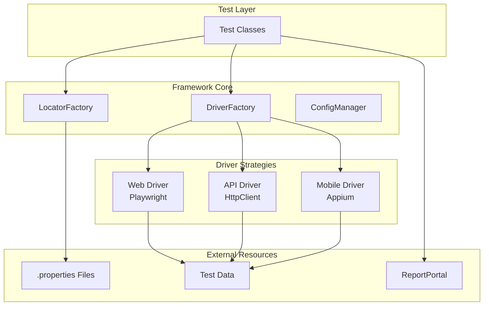

# TAFLEX Documentation

<p align="center">
  
</p>

<p align="center">
  <strong>Enterprise Test Automation Framework</strong>
</p>

<p align="center">
  <a href="https://github.com/your-org/taflex/actions"></a>
  <a href="https://github.com/your-org/taflex/releases"></a>
  <a href="https://opensource.org/licenses/Apache-2.0"></a>
  <a href="https://java.oracle.com"></a>
</p>

---

## 🎯 What is TAFLEX?

TAFLEX is a **unified, enterprise-grade test automation framework** designed for testing Web, API, and Mobile applications using a single codebase. Built with modern Java 23+, it leverages the Strategy Pattern to provide runtime driver resolution, making it incredibly flexible and maintainable.

### ✨ Key Highlights

<div class="grid cards" markdown>

-   :material-rocket-launch:{ .lg .middle } **Quick Setup**

    ---

    Get started in minutes with automated setup scripts and comprehensive documentation.

-   :material-strategy:{ .lg .middle } **Strategy Pattern**

    ---

    Runtime driver resolution allows switching between Web, API, and Mobile without code changes.

-   :material-file-document-outline:{ .lg .middle } **Externalized Locators**

    ---

    All selectors stored in `.properties` files, completely decoupled from test code.

-   :material-parallel:{ .lg .middle } **Parallel Execution**

    ---

    Built-in support for parallel test execution with TestNG.

-   :material-database:{ .lg .middle } **Database Integration**

    ---

    HikariCP connection pooling with JDBC wrapper for test data management.

-   :material-chart-line:{ .lg .middle } **Rich Reporting**

    ---

    Native ReportPortal integration with detailed test analytics.

</div>

---

## 🚀 Quick Start

Get up and running in 3 simple steps:

### 1. Clone and Setup

```bash
git clone https://github.com/your-org/taflex.git
cd taflex
./setup.sh
```

### 2. Configure Environment

```bash
# Copy and customize configuration
cp automation.properties.template automation.properties
nano automation.properties
```

### 3. Run Your First Test

```bash
# Run web tests
./gradlew webTest

# Run API tests
./gradlew apiTest

# Run mobile tests
./gradlew mobileTest
```

---

## 📚 Documentation Structure

<div class="grid" markdown>

<div markdown>

### Getting Started
Learn the basics and run your first test

- [Quick Start Guide](getting-started/quickstart.md)
- [Installation](getting-started/installation.md)
- [Configuration](getting-started/configuration.md)
- [Writing Your First Test](getting-started/first-test.md)

</div>

<div markdown>

### Architecture
Understand the framework design

- [Architecture Overview](architecture/overview.md)
- [Strategy Pattern](architecture/strategy-pattern.md)
- [Driver Architecture](architecture/drivers.md)
- [Locator System](architecture/locators.md)

</div>

<div markdown>

### User Guides
Tailored guides for different roles

- [QA Engineers](guides/qa-engineers.md)
- [Developers](guides/developers.md)
- [Managers](guides/managers.md)
- [DevOps](guides/devops.md)

</div>

<div markdown>

### API Reference
Complete API documentation

- [Core Interfaces](api/core-interfaces.md)
- [Driver API](api/driver-api.md)
- [Locator API](api/locator-api.md)
- [Database API](api/database-api.md)

</div>

</div>

---

## 🏗️ Architecture Overview



---

## 💻 Code Example

### Web Test

```java
@Test
groups = {"smoke"}
public void shouldLoginSuccessfully() {
    // Navigate using externalized locator
    driver.navigateTo("login.page.url");
    
    // Use externalized selectors
    driver.type("login.username.field", "testuser");
    driver.type("login.password.field", "password123");
    driver.click("login.submit.button");
    
    // Verify
    assertTrue(driver.isVisible("dashboard.welcome.message"));
}
```

### API Test

```java
@Test
groups = {"regression"}
public void shouldCreateUser() {
    ApiDriverStrategy api = (ApiDriverStrategy) driver;
    
    String payload = """{"name": "Test User", "email": "test@example.com"}""";
    ApiResponse response = api.post("user.create.endpoint", payload);
    
    assertEquals(response.getStatusCode(), 201);
}
```

---

## 🎯 Who Should Use TAFLEX?

<div class="grid" markdown>

<div markdown>

### QA Engineers & Testers

- :white_check_mark: No coding required for basic tests
- :white_check_mark: Externalized locators in plain text
- :white_check_mark: Built-in retry and screenshot mechanisms
- :white_check_mark: Rich reporting out of the box

[QA Guide →](guides/qa-engineers.md)

</div>

<div markdown>

### Developers

- :white_check_mark: Clean, extensible architecture
- :white_check_mark: Type-safe Java 23+ codebase
- :white_check_mark: Easy to add new driver types
- :white_check_mark: Full IDE support with IntelliJ

[Developer Guide →](guides/developers.md)

</div>

<div markdown>

### Managers

- :white_check_mark: Single framework for all test types
- :white_check_mark: Reduced maintenance overhead
- :white_check_mark: Comprehensive reporting dashboards
- :white_check_mark: Clear ROI metrics

[Manager Guide →](guides/managers.md)

</div>

<div markdown>

### DevOps Engineers

- :white_check_mark: Easy CI/CD integration
- :white_check_mark: Docker support
- :white_check_mark: Parallel execution
- :white_check_mark: Environment-based configuration

[DevOps Guide →](guides/devops.md)

</div>

</div>

---

## 📊 Features Comparison

| Feature | TAFLEX | Selenium | Cypress | Playwright |
|---------|--------|----------|---------|------------|
| **Unified Framework** | :white_check_mark: | :x: | :x: | :x: |
| **Web + API + Mobile** | :white_check_mark: | :x: | :x: | :x: |
| **Externalized Locators** | :white_check_mark: | Manual | :x: | :x: |
| **Java 23+** | :white_check_mark: | 8+ | JS Only | :white_check_mark: |
| **Strategy Pattern** | :white_check_mark: | :x: | :x: | :x: |
| **ReportPortal** | Native | Plugin | Plugin | Plugin |
| **Parallel Execution** | :white_check_mark: | Limited | :white_check_mark: | :white_check_mark: |

---

## 🤝 Contributing

We welcome contributions! Please see our [Contributing Guidelines](contributing/guidelines.md) for details.

## 📄 License

TAFLEX is licensed under the [Apache License 2.0](https://opensource.org/licenses/Apache-2.0).

## 💬 Support

- :fontawesome-brands-slack: **Slack**: [#taflex](https://your-org.slack.com/archives/taflex)
- :fontawesome-brands-github: **GitHub Issues**: [Report an Issue](https://github.com/your-org/taflex/issues)
- :fontawesome-solid-envelope: **Email**: [automation-team@company.com](mailto:automation-team@company.com)

---

<p align="center">
  <strong>Happy Testing! 🚀</strong>
</p>