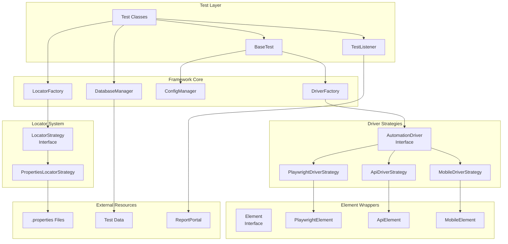
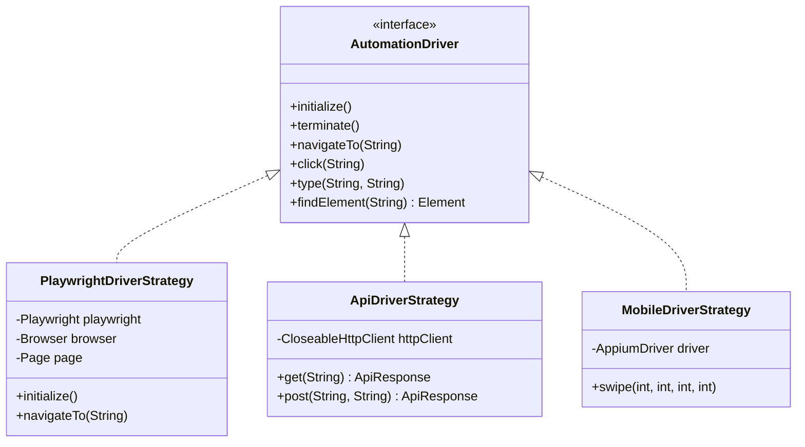
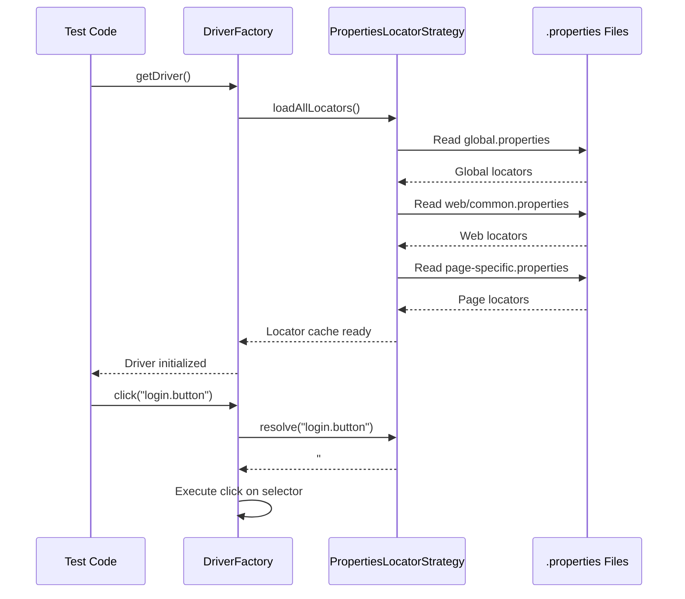
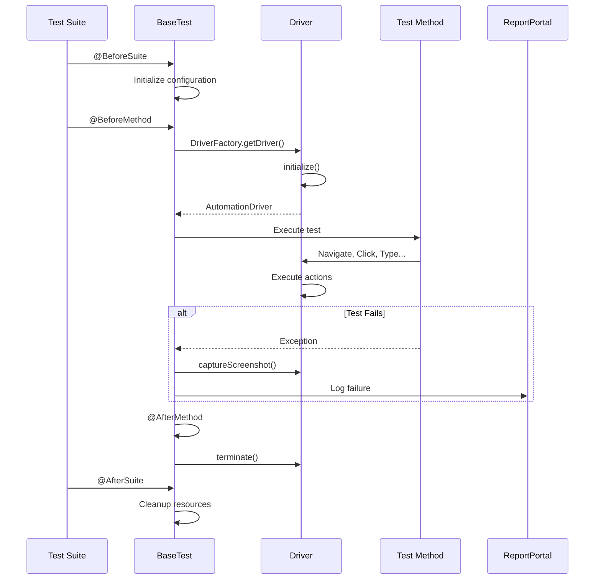
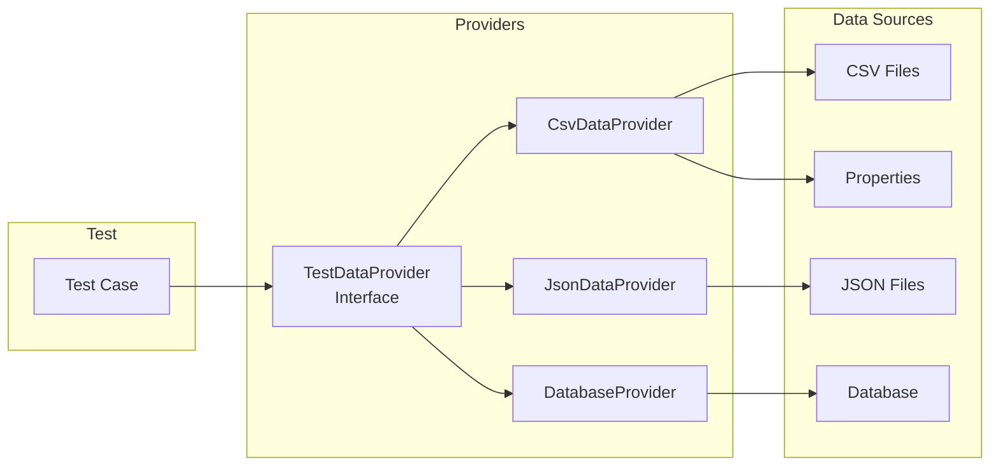
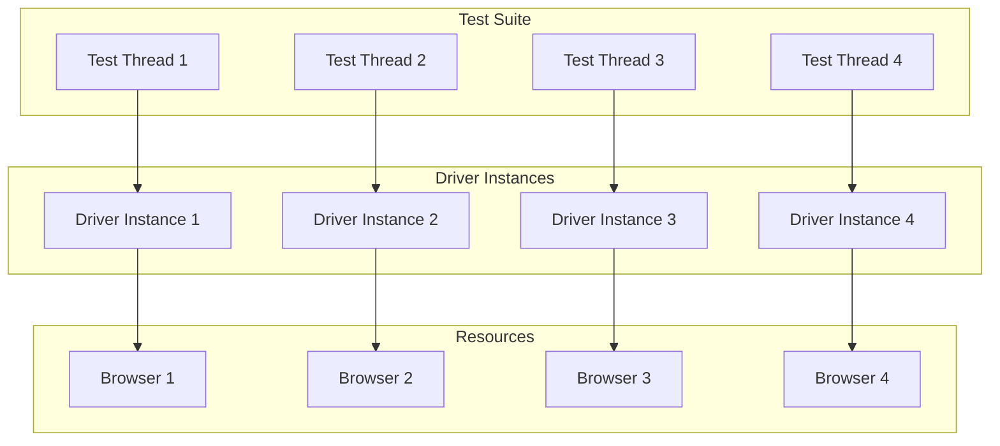
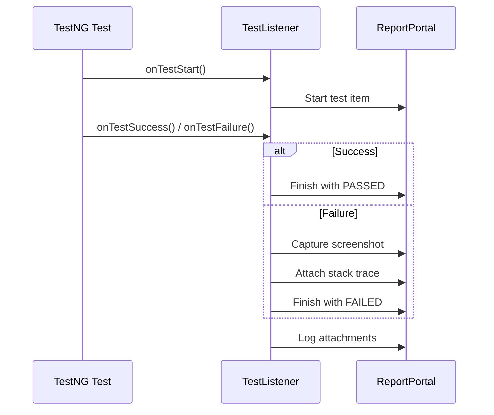

# Architecture Overview

TAFLEX is built on a robust, extensible architecture that follows enterprise-grade design patterns. This document explains the architectural decisions and how different components interact.

## Design Philosophy

TAFLEX follows these core principles:

| Principle | Description |
|-----------|-------------|
| **🧩 Strategy Pattern** | Runtime driver resolution allows the same test code to run on Web, API, or Mobile without modification. |
| **📄 Separation of Concerns** | Test logic is completely decoupled from driver implementation and locator definitions. |
| **⚙️ Configuration Over Code** | Behavior is controlled through external configuration, not hardcoded values. |
| **🧪 Test-First Design** | Every component is designed with testability in mind, following TDD principles. |

## High-Level Architecture



## Component Breakdown

### 1. Driver Layer

The Driver Layer implements the **Strategy Pattern**, allowing runtime selection of the appropriate driver implementation.



**Key Benefits:**
- ✅ Single test codebase for all platforms
- ✅ Easy to add new driver types
- ✅ Driver changes don't affect test code
- ✅ Supports parallel execution with different drivers

### 2. Locator System

All locators are externalized in `.properties` files using the **PropertiesLocatorStrategy**.



**Locator Loading Order:**

1. `global.properties` - Common across all modes
2. `{mode}/common.properties` - Mode-specific common locators
3. `{mode}/*.properties` - Page/feature-specific locators

Later files override earlier ones, allowing fine-grained customization.

### 3. Configuration Management

The **ConfigManager** provides centralized access to `automation.properties`:

```java
// Get string property
String browser = ConfigManager.getProperty("web.browser");

// Get with default
int timeout = ConfigManager.getIntProperty("web.timeout", 30);

// Get boolean
boolean headless = ConfigManager.getBooleanProperty("web.headless", false);
```

**Configuration Hierarchy:**

1. System properties (highest priority)
2. `automation.properties` file
3. `automation.properties.template` (defaults)

### 4. Test Execution Flow



## Data Flow

### Test Data Management



## Parallel Execution Architecture

TAFLEX supports parallel execution at multiple levels:



**Configuration:**

```properties
parallel.enabled=true
parallel.threads=4
```

## Reporting Integration



## Technology Stack

| Category | Technologies |
|----------|-------------|
| **Core Framework** | Java 21+, Gradle 8.5+, TestNG 7.8+ |
| **Web Testing** | Playwright 1.41+, Chromium/Firefox/WebKit |
| **API Testing** | Apache HttpClient 4.5+, Jackson 2.16+ |
| **Mobile Testing** | Appium 9.0+, Android/iOS |
| **Data & Reporting** | HikariCP 5.1+, ReportPortal 5.3+, SLF4J + Logback |
| **Utilities** | AssertJ 3.24+, Apache Commons |

## Extensibility Points

TAFLEX is designed for extension at multiple levels:

### 1. Custom Driver Strategies

```java
public class CustomDriverStrategy implements AutomationDriver {
    // Implement interface methods
    // Register in DriverFactory
}
```

### 2. Custom Locator Strategies

```java
public class DatabaseLocatorStrategy implements LocatorStrategy {
    // Load locators from database
    // Register in LocatorFactory
}
```

### 3. Custom Test Listeners

```java
public class CustomListener extends TestListenerAdapter {
    // Override lifecycle methods
    // Add to testng.xml
}
```

## Performance Considerations

### Driver Caching

The `DriverFactory` caches driver instances to avoid repeated initialization:

```java
// First call - creates and caches
AutomationDriver driver1 = DriverFactory.getDriver("web");

// Second call - returns cached instance
AutomationDriver driver2 = DriverFactory.getDriver("web");
// driver1 == driver2
```

### Locator Caching

Locators are loaded once and cached in memory:

```java
// Loads and caches all .properties files
LocatorStrategy strategy = LocatorFactory.getLocatorStrategy();

// Subsequent resolves use cache
String selector = strategy.resolve("login.button"); // Fast lookup
```

### Connection Pooling

Database connections use HikariCP for optimal performance:

```properties
db.pool.size=10
db.pool.minIdle=2
```

## Security

### Configuration Security

- `automation.properties` is gitignored
- Sensitive data never committed
- Template file provides safe defaults

### Credential Management

```properties
# Use environment variables or secure vaults
db.password=${DB_PASSWORD}
api.auth.token=${API_TOKEN}
```
