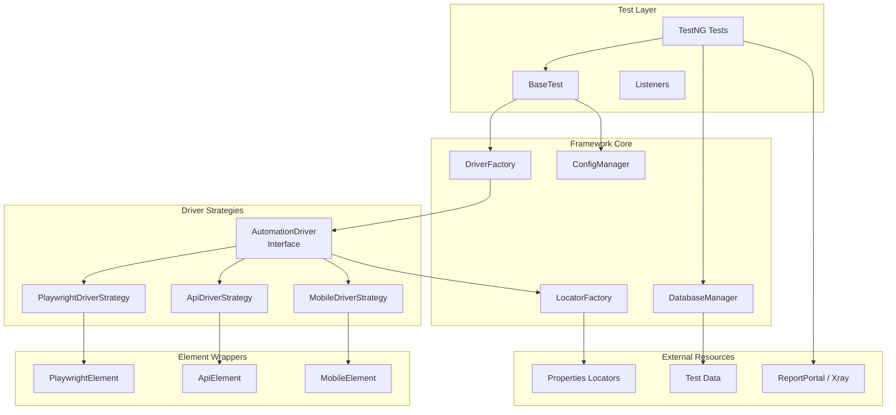
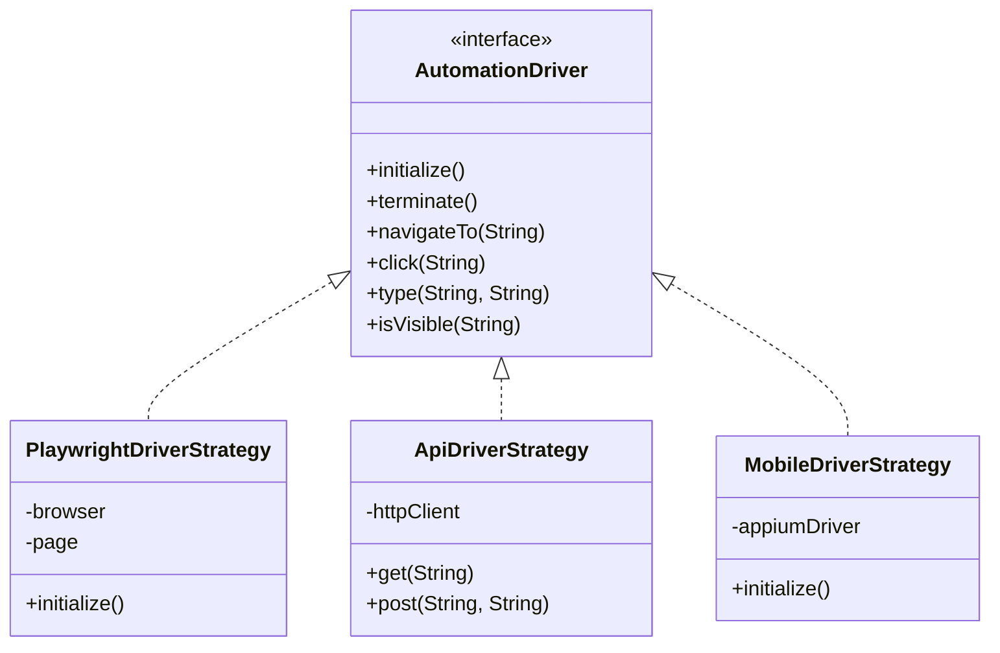

# Architecture Overview

TAFLEX is built on a robust, extensible architecture that follows enterprise-grade design patterns. This document explains the architectural decisions and how different components interact.

## Design Philosophy

TAFLEX follows these core principles:

| Principle | Description |
|-----------|-------------|
| **🧩 Strategy Pattern** | Runtime driver resolution allows the same test code to run on Web, API, or Mobile without modification. |
| **📄 Separation of Concerns** | Test logic is completely decoupled from driver implementation and locator definitions. |
| **⚙️ Configuration Over Code** | Behavior is controlled through external configuration, not hardcoded values. |
| **🧪 Modern Java** | Leverages Java 21 features for clean and efficient automation code. |

## High-Level Architecture

## Component Breakdown

### 1. Driver Layer

The Driver Layer implements the **Strategy Pattern**, allowing runtime selection of the appropriate driver implementation based on the `execution.mode` property.

### 2. Locator System

All locators are externalized in `.properties` files and resolved by the `LocatorFactory`.

**Locator Loading Order:**

1. `global.properties` - Common across all modes.
2. `{mode}/common.properties` - Mode-specific common locators.
3. `{mode}/{page}.properties` - Page/feature-specific locators.

### 3. Configuration Management

The **ConfigManager** provides centralized access to properties defined in `automation.properties`, with support for environment variable overrides.

### 4. Test Execution Flow

1. **Suite Start**: TestNG starts the execution.
2. **Setup**: `BaseTest` calls `DriverFactory` to get the correct driver instance.
3. **Initialization**: The driver initializes the underlying tool (Playwright, HttpClient, or Appium).
4. **Execution**: Tests interact with the `AutomationDriver` using logical locator names.
5. **Teardown**: `BaseTest` terminates the driver and reports results.

## Technology Stack

| Category | Technologies |
|----------|-------------|
| **Core Language** | Java 21+ |
| **Build Tool** | Gradle 8.5 |
| **Test Runner** | TestNG |
| **Web Testing** | Playwright for Java |
| **API Testing** | Apache HttpClient |
| **Mobile Testing** | Appium (Java Client) |
| **Database** | HikariCP, JDBC |
| **Reporting** | ReportPortal, Xray Cloud |
| **Logging** | SLF4J with Logback |
