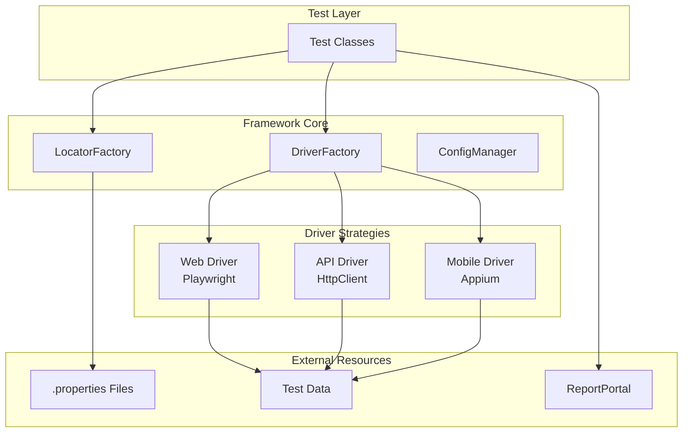

# TAFLEX

**Enterprise Test Automation Framework**

[](https://github.com/vinipx/taflex/actions)
[](https://github.com/vinipx/taflex/releases)
[](https://opensource.org/licenses/Apache-2.0)
[](https://java.oracle.com)

---

## 🎯 What is TAFLEX?

TAFLEX is a **unified, enterprise-grade test automation framework** designed for testing Web, API, and Mobile applications using a single codebase. Built with modern Java 23+, it leverages the Strategy Pattern to provide runtime driver resolution, making it incredibly flexible and maintainable.

### ✨ Key Highlights

| Feature | Description |
|---------|-------------|
| 🚀 **Quick Setup** | Get started in minutes with automated setup scripts and comprehensive documentation. |
| 🧩 **Strategy Pattern** | Runtime driver resolution allows switching between Web, API, and Mobile without code changes. |
| 📄 **Externalized Locators** | All selectors stored in `.properties` files, completely decoupled from test code. |
| ⚡ **Parallel Execution** | Built-in support for parallel test execution with TestNG. |
| 🗄️ **Database Integration** | HikariCP connection pooling with JDBC wrapper for test data management. |
| 📊 **Rich Reporting** | Native ReportPortal integration with detailed test analytics. |

---

## 🚀 Quick Start

Get up and running in 3 simple steps:

### 1. Clone and Setup

```bash
git clone https://github.com/vinipx/taflex.git
cd taflex
./setup.sh
```

### 2. Configure Environment

```bash
# Copy and customize configuration
cp automation.properties.template automation.properties
nano automation.properties
```

### 3. Run Your First Test

```bash
# Run web tests
./gradlew webTest

# Run API tests
./gradlew apiTest

# Run mobile tests
./gradlew mobileTest
```

---

## 📚 Documentation Structure

### Getting Started
Learn the basics and run your first test

- [Quick Start Guide](getting-started/quickstart.md)

### Architecture
Understand the framework design

- [Architecture Overview](architecture/overview.md)

### User Guides
Tailored guides for different roles

- [QA Engineers](guides/qa-engineers.md)
- [Developers](guides/developers.md)
- [Managers](guides/managers.md)

### API Reference
Complete API documentation

- [Core Interfaces](api/core-interfaces.md)

---

## 🏗️ Architecture Overview



---

## 💻 Code Example

### Web Test

```java
@Test(groups = {"smoke"})
public void shouldLoginSuccessfully() {
    // Navigate using externalized locator
    driver.navigateTo("login.page.url");

    // Use externalized selectors
    driver.type("login.username.field", "testuser");
    driver.type("login.password.field", "password123");
    driver.click("login.submit.button");

    // Verify
    assertTrue(driver.isVisible("dashboard.welcome.message"));
}
```

### API Test

```java
@Test(groups = {"regression"})
public void shouldCreateUser() {
    ApiDriverStrategy api = (ApiDriverStrategy) driver;

    String payload = """{"name": "Test User", "email": "test@example.com"}""";
    ApiResponse response = api.post("user.create.endpoint", payload);

    assertEquals(response.getStatusCode(), 201);
}
```

---

## 🎯 Who Should Use TAFLEX?

| Role | Benefits |
|------|----------|
| **QA Engineers & Testers** | No coding required for basic tests · Externalized locators in plain text · Built-in retry and screenshot mechanisms · Rich reporting out of the box |
| **Developers** | Clean, extensible architecture · Type-safe Java 23+ codebase · Easy to add new driver types · Full IDE support with IntelliJ |
| **Managers** | Single framework for all test types · Reduced maintenance overhead · Comprehensive reporting dashboards · Clear ROI metrics |
| **DevOps Engineers** | Easy CI/CD integration · Docker support · Parallel execution · Environment-based configuration |

---

## 📊 Features Comparison

| Feature | TAFLEX | Selenium | Cypress | Playwright |
|---------|--------|----------|---------|------------|
| **Unified Framework** | ✅ | ❌ | ❌ | ❌ |
| **Web + API + Mobile** | ✅ | ❌ | ❌ | ❌ |
| **Externalized Locators** | ✅ | Manual | ❌ | ❌ |
| **Java 23+** | ✅ | 8+ | JS Only | ✅ |
| **Strategy Pattern** | ✅ | ❌ | ❌ | ❌ |
| **ReportPortal** | Native | Plugin | Plugin | Plugin |
| **Parallel Execution** | ✅ | Limited | ✅ | ✅ |

---

## 🤝 Contributing

We welcome contributions! Please see our [Contributing Guidelines](contributing/guidelines.md) for details.

## 📄 License

TAFLEX is licensed under the [Apache License 2.0](https://opensource.org/licenses/Apache-2.0).

## 💬 Support

- **GitHub Issues**: [Report an Issue](https://github.com/vinipx/taflex/issues)
- **Email**: [automation-team@company.com](mailto:automation-team@company.com)

---

**Happy Testing! 🚀**
