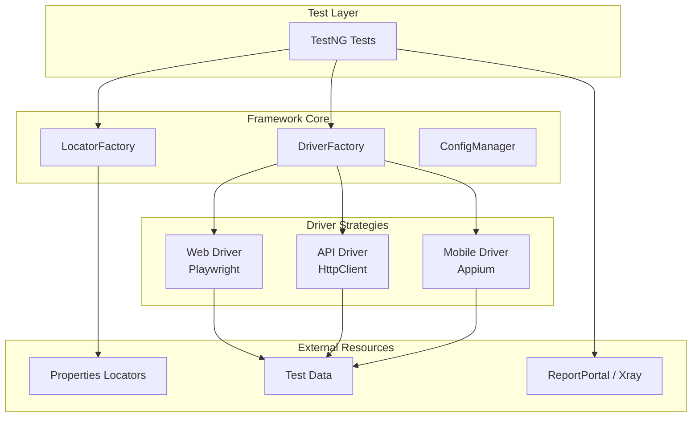

# TAFLEX

**Enterprise Test Automation Framework**

[](https://openjdk.org/)
[](https://gradle.org/)
[](https://playwright.dev/java/)
[](LICENSE)

---

## 🎯 What is TAFLEX?

TAFLEX is a **unified, enterprise-grade test automation framework** designed for testing Web, API, and Mobile applications using a single codebase. It leverages modern Java 21, Playwright, Appium, and Apache HttpClient to deliver fast, reliable, and maintainable automation.

### ✨ Key Highlights

| Feature | Description |
|---------|-------------|
| 🚀 **Quick Setup** | Modern Gradle-based workflow with automated setup script. |
| 🧩 **Strategy Pattern** | Runtime driver resolution between Web, API, and Mobile platforms. |
| 📄 **Externalized Locators** | Selectors stored in `.properties` files, decoupled from test logic. |
| 🛡️ **Type-Safe Config** | Centralized configuration management via `automation.properties`. |
| 🗄️ **Database Support** | Native support for PostgreSQL and MySQL via HikariCP connection pooling. |
| 📊 **Enterprise Reporting** | Native integration with ReportPortal and Xray (Jira). |
| 🛡️ **Code Quality** | Automated hygiene checks with Checkstyle and PMD. |

---

## 🚀 Quick Start

Get up and running in 3 simple steps:

### 1. Clone and Setup

```bash
# Clone the repository
git clone https://github.com/vinipx/taflex.git
cd taflex

# Run the automated setup
./setup.sh
```

### 2. Configure Environment

Update the `automation.properties` file with your specific settings:

```properties
# Update with your specific credentials
execution.mode=web
web.browser=chromium
web.base.url=https://www.example.com
```

### 3. Run Your First Test

```bash
# Run Web tests
./gradlew webTest

# Run API tests
./gradlew apiTest
```

---

## 🏗️ Architecture Overview



---

## 💻 Code Example

### Web Test

```java
package io.github.vinipx.taflex.tests.web;

import io.github.vinipx.taflex.base.BaseTest;
import org.testng.Assert;
import org.testng.annotations.Test;

public class LoginTests extends BaseTest {
    
    @Test(groups = {"smoke"})
    public void shouldLoginSuccessfully() {
        // Navigate using externalized URL locator
        driver.navigateTo("login.page.url");
        
        // Use externalized locators
        driver.type("login.username.field", "testuser");
        driver.type("login.password.field", "password123");
        driver.click("login.submit.button");
        
        // Assertions
        Assert.assertTrue(driver.isVisible("dashboard.welcome.message"));
    }
}
```

---

## 🎯 Who Should Use TAFLEX?

| Role | Benefits |
|------|----------|
| **QA Engineers & Testers** | Low-code locator management · High-level unified API · Automatic retries & screenshots. |
| **Developers** | Modern Java 21 features · Strategy pattern extensibility · Mature Gradle ecosystem. |
| **Managers** | Unified stack for Web/API/Mobile · Requirement traceability via Xray · Detailed dashboards. |
| **DevOps Engineers** | CI/CD ready · Seamless GitHub Actions integration · Parallel execution support. |

---

## 📄 License

TAFLEX is licensed under the [Apache License 2.0](LICENSE).

---

**Happy Testing! 🚀**
